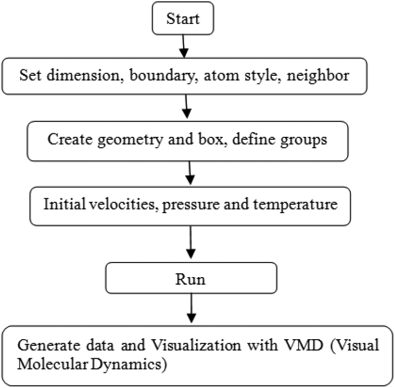

---

## Slide 1 — Why *Classical* Molecular Dynamics?

::: incremental
- **Classical Molecular Dynamics (MD)** simulates how atoms or molecules move by **numerically integrating Newton’s equations of motion for every particle** in the system — positions and velocities are updated at each time–step using a chosen force-field \(U(\{\mathbf r\})\). :contentReference[oaicite:0]{index=0}  
- The method treats particles **classically** (no explicit quantum effects) but captures temperature, pressure & collective phenomena in systems spanning *\(10^2\!-\!10^8\) atoms* and *ps → µs* time windows. :contentReference[oaicite:1]{index=1}  
- **Historic origin:** *Alder & Wainwright (1957)* used hard-sphere MD to show fluid–solid phase transitions — the first computer “microscope”. :contentReference[oaicite:2]{index=2}  
- **Today:** MD is the bridge between quantum DFT (Å & fs) and continuum FEM (mm & s), enabling predictive metallurgy, diffusion, dislocation kinetics, and nanomechanics. :contentReference[oaicite:3]{index=3}  
:::

{#fig:history width="80%"}

> **Key equation:**  
> \[
> m_i\frac{d^{2}\mathbf r_i}{dt^{2}} = -\nabla_{\!i}\,U(\{\mathbf r\}) ,
> \quad U = \text{EAM/MEAM/… force-field}
> \]  
> *\(m_i\)* = atom mass, *\(\mathbf r_i\)* = position, *\(U\)* = potential energy. :contentReference[oaicite:4]{index=4}

---

## Slide 2 — What is LAMMPS?

- **Large-scale Atomic/Molecular Massively Parallel Simulator**  
- Written in modern C++; hundreds of interatomic potentials supported  
- Scales from laptop to supercomputer via MPI/OpenMP/GPU  
- {#fig:lammps_logo width="60%"}

---

## Slide 3 — MD integration loop

- Below is a schematic of the MD time-integration loop:

{#fig:mdloop width="80%"}

> $\Delta t \ll \frac{2\pi}{\omega_{\max}}$

---
